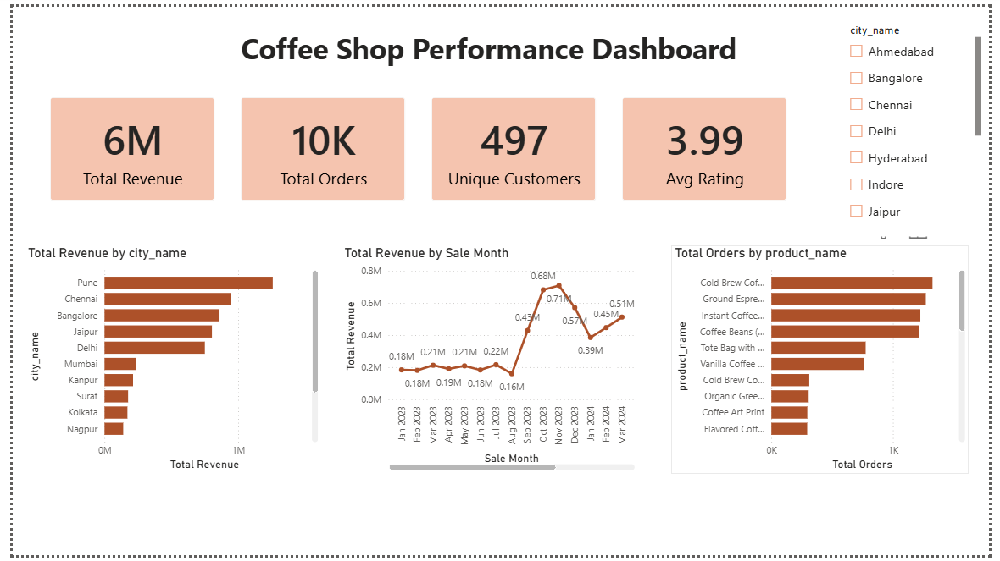
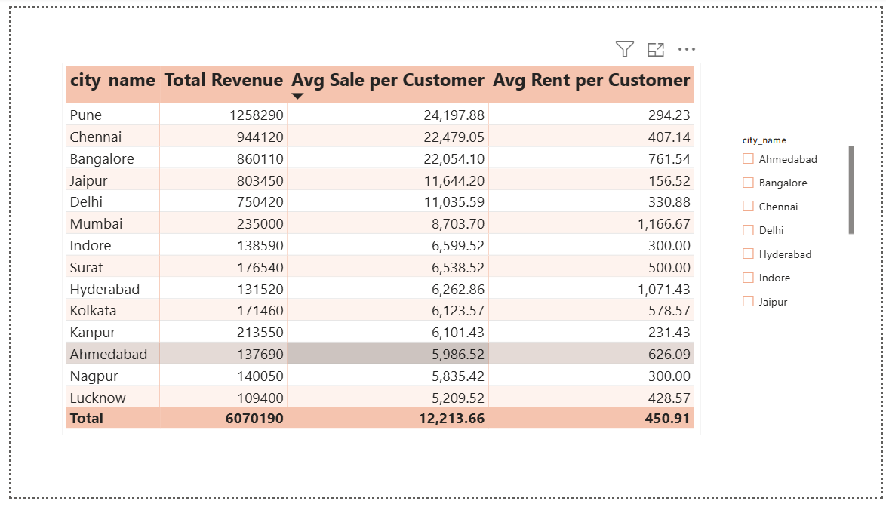

# Coffee Shop Sales Analysis

A data analysis project that looks at coffee shop sales across different cities in India — built using **SQL** and **Power BI**.

The goal: figure out which cities are performing best, which products sell the most, and where the business should expand next.

---

## What's in this project

```
sql/       → Database setup + 12 SQL queries
powerbi/   → Interactive Power BI dashboard
screenshots/ → Dashboard preview images
```

---

## Tools used

- **MySQL** — to store the data and write queries
- **Power BI** — to build the interactive dashboard

---

## What the SQL does

The database has 4 tables: **City**, **Customers**, **Products**, and **Sales**.

Using SQL, I answered questions like:
- How much revenue did each city generate?
- Which products sell the most?
- What are the top products in each city?
- How does monthly sales growth look, city by city?
- Which cities have the best sales vs. rent ratio?

---

## The Dashboard

### Page 1 — Overview
Quick snapshot: total revenue, total orders, customers, average rating, monthly sales trend, and top-selling products.



### Page 2 — City Performance
Compares each city's revenue against how much it costs (rent) to run a shop there.



### Page 3 — Products & Ratings
Shows which products are ordered the most and how customers rate them.


---

## Key Takeaways

- **Pune** has the highest revenue and low rent costs — the strongest city for growth.
- **Delhi** has the most customers and a large potential market.
- **Jaipur** is the most cost-efficient — low rent, strong sales.
- Product ratings are fairly consistent across the board (no major quality issues).

**Recommendation:** Focus expansion efforts on Pune, Delhi, and Jaipur.

---

## A challenge I solved

The sales date was stored as plain text in the database instead of a proper date. This made the dashboard chart look broken — showing every single day instead of a clean monthly trend.

**Fix:** Converted the text into a real date, then grouped it by month, so the trend line reads clearly.

---

## How to view this project

- Open the `.sql` file in MySQL to see the database and queries.
- Open the `.pbix` file in Power BI Desktop to explore the live dashboard.
